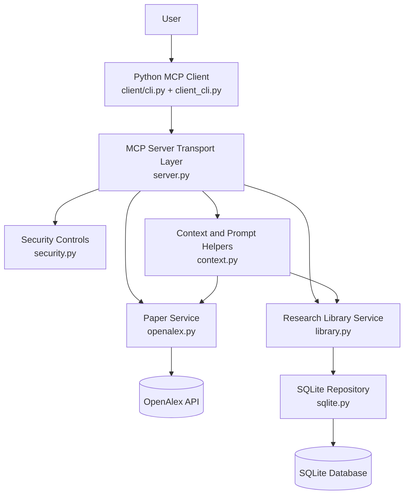
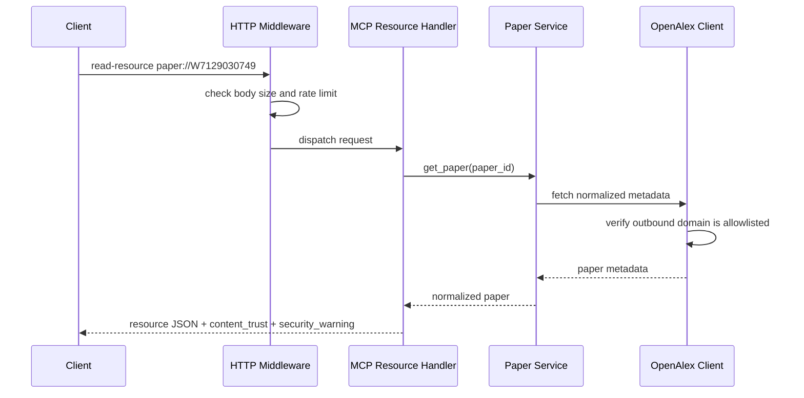
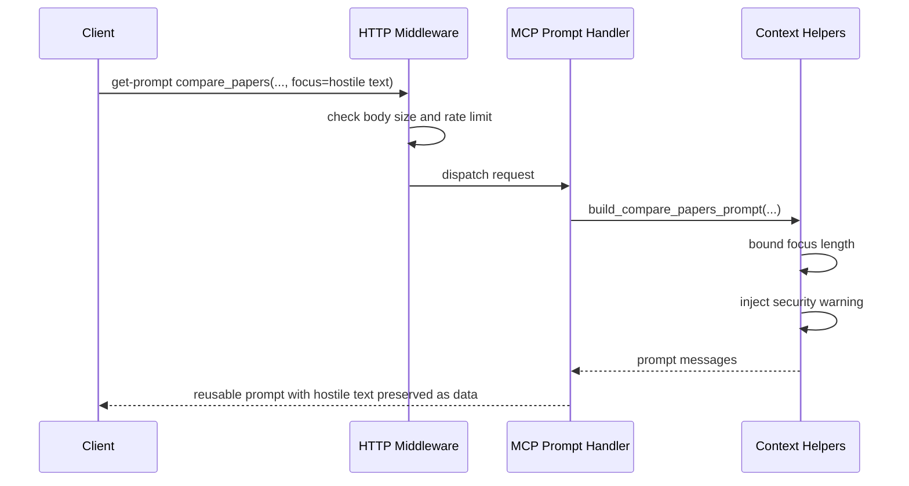
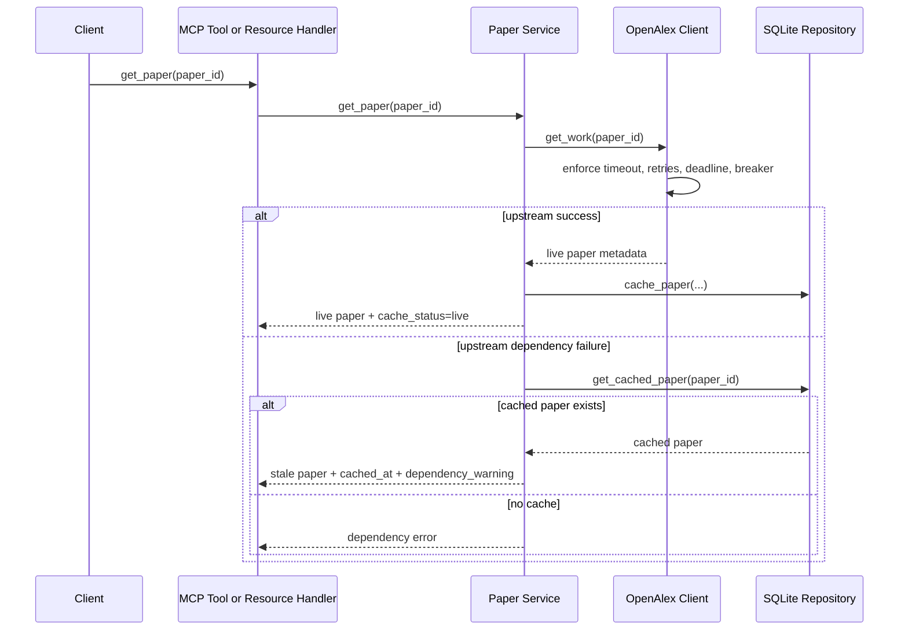
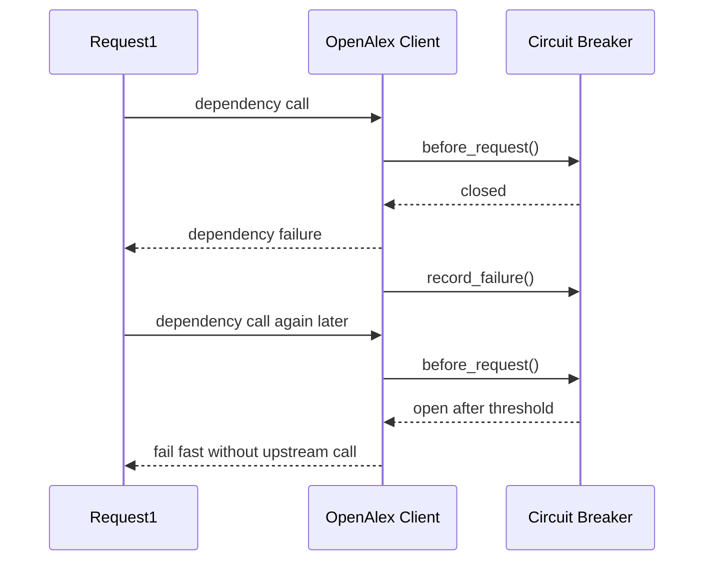
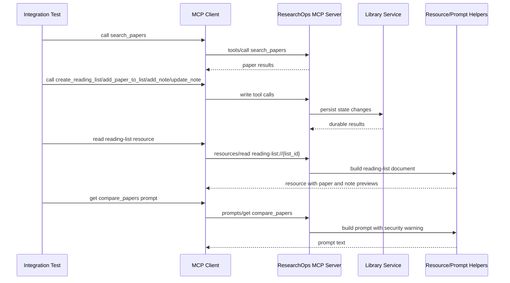
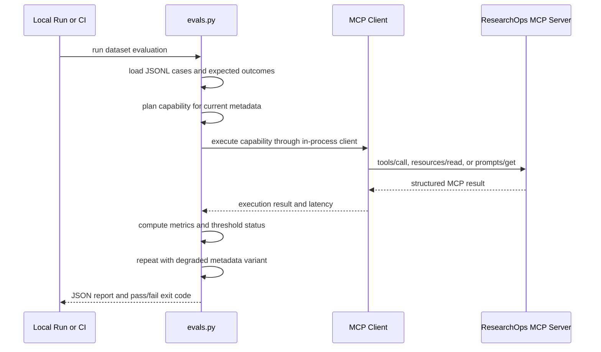
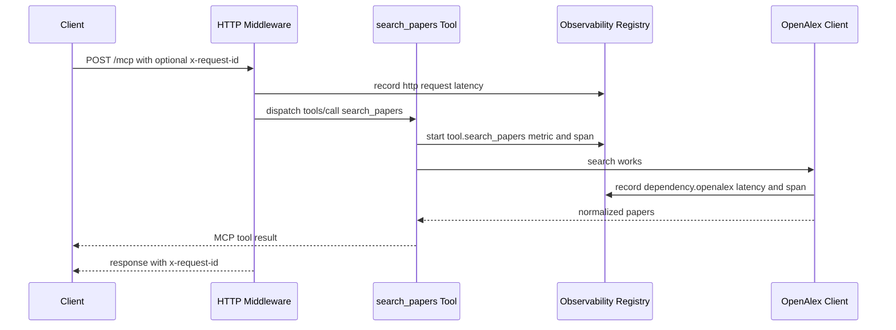
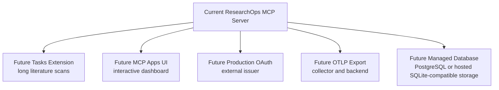

# ResearchOps MCP Design

## Purpose

This document records the design of the ResearchOps MCP project as it evolved through the roadmap.
It is organized day by day so the architecture and boundary changes are easy to review later.
The latest completed day appears at the end.

## Design Principles

- Keep the MCP interface stable even when the backing implementation changes.
- Separate transport, business logic, persistence, and external API access.
- Use tools for actions, resources for stable context, and prompts for reusable reasoning scaffolds.
- Keep write operations explicit and protected with validation, idempotency, and concurrency checks.
- Prefer simple local infrastructure first, then grow toward production architecture later.

## Current Architecture Snapshot

### Layer Summary

- Client layer: Python CLI for discovery, reads, prompts, tool calls, approval gating, and latency reporting.
- Transport layer: MCP tools, resources, and prompts exposed by the server over `stdio` or Streamable HTTP.
- Service layer: business rules, validation, idempotency, optimistic concurrency, and orchestration.
- Repository layer: SQLite schema, transactions, and durable reads and writes.
- External dependency layer: OpenAlex-backed paper lookup and search.
- Security layer: HTTP middleware, outbound controls, trust labeling, and validation limits.
- Verification layer: automated MCP workflow, contract, regression, evaluation, observability, and CI checks.

### File Ownership

- `src/researchops_mcp/server.py`: MCP transport layer and server factory.
- `src/researchops_mcp/security.py`: shared security controls and middleware.
- `src/researchops_mcp/observability.py`: structured logging, request IDs, metrics, and OpenTelemetry API span helpers.
- `src/researchops_mcp/services/openalex.py`: OpenAlex integration and paper normalization.
- `src/researchops_mcp/services/context.py`: resource and prompt rendering helpers.
- `src/researchops_mcp/services/library.py`: durable reading-list and note business logic.
- `src/researchops_mcp/repositories/sqlite.py`: SQLite persistence and transaction boundary.
- `src/researchops_mcp/client_cli.py`: packaged CLI client implementation.
- `client/cli.py`: thin roadmap-friendly client entry point.
- `tests/integration/test_protocol_workflows.py`: end-to-end MCP workflow and protocol-shape verification.
- `tests/unit/test_mcp_metadata_regression.py`: MCP catalog and schema regression checks.
- `src/researchops_mcp/evals.py`: deterministic Day 12 evaluation runner and threshold gate.
- `tests/unit/test_eval_runner.py`: evaluation-runner regression checks.
- `tests/evals/researchops_eval_dataset.jsonl`: prompt evaluation dataset.

### Current Capability Map

#### Tools

- `health_check`: server status and storage mode.
- `search_papers`: bounded OpenAlex paper search.
- `get_paper`: one normalized paper lookup.
- `export_bibtex`: one paper citation export.
- `create_reading_list`: create durable list state.
- `add_paper_to_list`: persist paper membership in a list.
- `add_note`: create a durable note tied to a list and paper.
- `update_note`: update a note with optimistic concurrency.
- `delete_note`: delete a note with confirmation and optimistic concurrency.

#### Resources

- `paper://{paper_id}`: stable paper context.
- `reading-list://{list_id}`: stable reading-list context backed by persistent storage.

#### Prompts

- `compare_papers`: reusable comparison scaffold.
- `generate_literature_review`: reusable literature-review scaffold.

### High-Level Diagram

## Day 3: OpenAlex Read Layer

### What Changed

Day 3 replaced mock paper results with a real OpenAlex-backed read path and introduced a dedicated citation-export tool.

### Design Decisions

#### Why OpenAlex

OpenAlex was chosen because it supports paper metadata search and lookup without adding early authentication or full-text complexity.
It is a good fit for:
- `search_papers`
- `get_paper`
- `export_bibtex`

#### Why Keep Citation Export Separate

`export_bibtex` is a separate tool because citation export is a distinct user goal with a different output contract.
This keeps `get_paper` narrow and avoids mode-heavy tool design.

### Day 3 Architecture Impact

- Introduced a paper service layer between MCP handlers and the upstream API.
- Added normalized paper shaping so MCP outputs stay stable even if upstream responses vary.
- Kept the server read-only at this stage.

## Day 4: Resources and Prompts

### What Changed

Day 4 introduced model-facing context primitives on top of the read-only server:
- stable resources
- reusable prompts
- temporary in-memory reading-list context

### Resource Design

#### `paper://{paper_id}`

This resource exposes one paper as stable MCP-readable context.
It exists so paper context can be reused without forcing every tool to return large payloads.

#### `reading-list://{list_id}`

This resource was introduced before persistence existed.
The design goal was to establish the correct MCP interface first, then change the backing store later.

### Prompt Design

- `compare_papers` provides reusable reasoning scaffolding for comparing two papers.
- `generate_literature_review` provides reusable literature-review scaffolding over selected papers.

Prompts stay separate from storage and retrieval logic.
They are model-facing templates, not backend action tools.

## Day 5: Persistence and Write Safety

### What Changed

Day 5 replaced temporary reading-list backing with SQLite persistence and introduced the first durable write tools.

### Why SQLite

SQLite was chosen for the local persistence phase because it keeps the dependency footprint small while still supporting:
- schema design
- transactions
- durable state
- idempotency storage
- optimistic concurrency

### Why a Repository Layer

The repository layer keeps SQL and database concerns separate from:
- MCP transport code
- business rules
- prompt and resource rendering logic

This makes the persistence logic easier to test and replace later.

### Why a Service Layer

The service layer owns business rules such as:
- validating idempotency keys
- checking that a paper is already in a reading list before allowing a note
- deciding when a retry should return a previous result
- checking stale note versions before updating or deleting

Those rules do not belong in SQL and do not belong in the MCP handler itself.

## Day 6: Local CLI Client

### What Changed

Day 6 added a Python CLI client so the project can be exercised from the client side, not just the server side.

### Client Responsibilities

The client owns behavior that the server should not own:
- capability discovery
- listing tools, resource templates, and prompts
- reading resources
- invoking tools
- gating write tools behind client approval
- reporting status and latency

## Day 7: Streamable HTTP and Staging Deployment

### What Changed

Day 7 added remote-style serving and the first public staging deployment.
The same MCP surface now works over both `stdio` and Streamable HTTP.

### Transport Strategy

Day 7 keeps one shared `MCPServer` capability factory and adds transport-aware startup instead of building a separate HTTP-only server.

## Day 8: Authentication, Authorization, and Multi-User Boundaries

### What Changed

Day 8 added the first real remote access-control layer.
The server now supports authenticated HTTP requests, scoped authorization, and per-user data ownership for reading lists and notes.

### Key Boundary

Scopes are enforced near the MCP boundary, while ownership is enforced at the repository query boundary.
That prevents cross-user access even when a caller has a broad read scope.

## Day 9: Security Hardening and Adversarial Boundaries

### What Changed

Day 9 kept the same MCP surface and hardened how the server handles hostile inputs, hostile model-facing content, and abusive HTTP traffic.

### New Security Module

A dedicated `security.py` module now centralizes controls that should not be scattered across unrelated tool handlers.
It currently owns:

- outbound URL allowlisting
- request-size enforcement
- fixed-window rate limiting
- log redaction helpers
- shared trust-warning constants and input-size constants

### Boundary Placement

#### Transport Middleware

The Streamable HTTP app now adds middleware before MCP request dispatch:

- `RequestSizeLimitMiddleware` rejects oversized HTTP bodies early with `413`
- `RateLimitMiddleware` rejects abusive request frequency with `429`
- Day 8 auth and scope middleware still run on the protected HTTP path

These controls belong at the HTTP boundary because they protect the whole service regardless of which tool or resource is being targeted.

#### Service-Level Validation

Business-specific bounds remain inside the service layer.
Examples:

- search query length
- reading-list name and description length
- note content length
- prompt focus and objective length

These checks belong with business rules because they are about semantic limits, not only raw transport safety.

#### External Dependency Boundary

The OpenAlex client now validates the final outbound URL against an explicit domain allowlist before performing the request.
Today the allowlist defaults to `api.openalex.org`.
That keeps the intended dependency boundary explicit and makes future SSRF-style mistakes easier to catch.

#### Model-Facing Boundary

Paper resources, reading-list resources, and prompt templates now add explicit trust metadata.
The current pattern is:

- `content_trust` field on model-facing documents
- `security_warning` field telling the model to treat paper metadata and notes as evidence, not instructions
- preserved hostile text as data rather than silently deleting it

This matters because the MCP server is not only an API layer. It is also a model-facing context layer.

### Request Flow: Hardened Paper Resource Read

### Request Flow: Hardened Prompt Construction

### Verification Added In Day 9

Automated tests now cover:

- non-OpenAlex outbound target rejection
- oversized query rejection
- oversized note rejection
- trust labeling on paper resources
- security warning inclusion in prompts
- sensitive-field redaction
- oversized HTTP body rejection
- HTTP rate limiting

Manual CLI verification on August 29, 2026 confirmed:

- `paper://W7129030749` returns `content_trust=untrusted_external_data`
- the paper resource includes a visible `security_warning`
- `compare_papers` includes hostile focus text but also the explicit security note
- repeated authenticated requests hit the configured rate limit
- Bob still cannot access Alice's list because Day 8 ownership enforcement remains underneath Day 9 hardening

### Known Limitations After Day 9

- rate limiting is in-memory and therefore single-process only
- the outbound allowlist is domain-based and intentionally simple
- the CLI still reports some HTTP rejections as generic transport errors
- the server does not yet use a centralized audit viewer or external SIEM pipeline

## Day 10: Reliability and Graceful Degradation

### What Changed

Day 10 hardened the OpenAlex dependency path so the server behaves predictably during transient failures, repeated failures, and upstream unavailability.

### Reliability Boundary Placement

#### Upstream Client Layer

`OpenAlexClient` now owns the dependency-facing resilience behavior:

- per-attempt timeout budget
- total deadline budget
- retry attempts
- exponential backoff with jitter
- circuit-breaker state

This logic belongs at the upstream client boundary because that is where dependency failures actually happen.

#### Repository Layer

The SQLite repository now exposes persistent paper-cache operations:

- `cache_paper(...)`
- `get_cached_paper(...)`

This keeps cache storage in the same layer that already owns durable paper records.

#### Service Layer

`PaperService` now owns fallback policy:

- successful reads refresh cached paper metadata
- `get_paper` can return cached metadata with `cache_status=stale` when OpenAlex is down
- `search_papers` still fails if the dependency is unavailable and no explicit safe fallback exists

This is a business-level decision because the service decides when stale data is acceptable.

### Request Flow: Resilient `get_paper`

### Request Flow: Circuit Breaker

### Reliability Semantics

- Safe automatic retries are limited to upstream read operations.
- Write tools still rely on idempotency and should not be retried casually by the server.
- Live and stale paper responses keep the same MCP shape as much as possible, with explicit cache metadata added only when relevant.
- Search results are not automatically served from cache because stale query ranking is harder to interpret safely.

### Verification Added In Day 10

Automated tests now cover:

- transient dependency failure followed by successful retry
- circuit-breaker opening after repeated failures
- cached stale-paper fallback when OpenAlex is unavailable
- hard dependency failure when no cached paper exists

Manual verification on September 1, 2026 confirmed:

- `python src/server.py --help` lists the new reliability flags
- `python client/cli.py call-tool health_check` returns the configured timeout, deadline, retry, and breaker settings

### Known Limitations After Day 10

- search-result caching is still intentionally absent
- the circuit breaker is in-memory and therefore process-local
- cached fallback currently applies to stable-ID paper retrieval, not broader search workflows
- there is not yet a manual Inspector-visible failure simulator for forcing upstream faults on demand

## Day 11: Protocol Testing and Contract Regression

### What Changed

Day 11 did not change the runtime MCP surface itself. It added a stronger verification layer around that surface so protocol behavior, schema shape, and post-write resource behavior are regression-tested.

### Verification Boundary Placement

#### Integration Layer

`tests/integration/test_protocol_workflows.py` now verifies end-to-end MCP behavior through a real MCP client.
It covers:

- successful tool workflows
- resource reads after write operations
- prompt rendering after state changes
- MCP-shaped HTTP tool error results

This belongs in an integration layer because it checks the contract as a client sees it, not only isolated business logic.

#### Contract Regression Layer

`tests/unit/test_mcp_metadata_regression.py` freezes contract-critical discovery details:

- tool names and order
- required arguments
- default argument values
- prompt argument shapes
- resource-template identity and MIME types

This belongs near the MCP discovery surface because schema and metadata drift are interface regressions even when internal logic still passes.

### Request Flow: Day 11 Workflow Verification

### Design Implications

- The project now has a distinct verification layer in addition to transport, service, repository, and security layers.
- Reading-list resources intentionally expose `content_preview` rather than full note bodies, and Day 11 regression checks now protect that boundary.
- Inspector CLI verification is useful as an external MCP-visible check, but the authoritative regression safety net remains the automated local test suite.

### Known Limitations After Day 11

- `docs/session-handoff.md` is still missing from the repository.
- Current Inspector CLI runs under local Node `v22.14.0` with engine warnings because the latest Inspector recommends `22.19.0+`.
- The current metadata regression tests freeze contract-critical fields, not every possible response detail.

## Day 12: Deterministic Evaluation And Metadata Quality

### What Changed

Day 12 added a dedicated evaluation layer that measures whether the model-facing MCP interface still drives correct capability selection, argument extraction, refusal behavior, and latency.

### Evaluation Boundary Placement

#### Evaluation Runner

`src/researchops_mcp/evals.py` now owns the Day 12 evaluation workflow.
It:

- loads the JSONL prompt dataset
- plans capability selection against the real ResearchOps MCP surface
- executes the selected capability through an in-process MCP client
- records metrics and latencies
- compares the current metadata against a degraded metadata variant
- enforces threshold checks for the current metadata variant

This belongs in a separate evaluation layer because it is neither application business logic nor pure unit testing.

#### Dataset Layer

`tests/evals/researchops_eval_dataset.jsonl` captures prompt-level expectations for:

- direct tool requests
- indirect tool requests
- resource and prompt retrieval
- no-tool requests
- ambiguous prompts
- workflow first-step prompts
- unauthorized actions
- prompt-injection attempts
- dependency-failure scenarios

The dataset is intentionally deterministic and uses stable paper IDs and list identifiers so regressions are easier to interpret.

#### Regression Workflow

`.github/workflows/evals.yml` now runs:

- `pytest tests/unit/test_eval_runner.py`
- `python -m researchops_mcp.evals --fail-on-thresholds`

This is intentionally narrow for Day 12. Day 13 can broaden CI into a fuller production pipeline.

### Request Flow: Day 12 Evaluation Run

### Design Implications

- ResearchOps now treats MCP metadata quality as a testable production concern.
- The project has a deterministic way to catch regressions where tool descriptions become too vague even if the backend code still works.
- Evaluation now complements unit, integration, contract, and security testing rather than replacing them.

### Known Limitations After Day 12

- The current harness is deterministic and heuristic, not a live model benchmark.
- Result-grounding accuracy and cost-per-task are not yet measured.
- The GitHub Actions workflow only covers the Day 12 regression slice; broader CI remains Day 13 work.

## Day 13: Observability And Scaling

### What Changed

Day 13 added operational visibility without changing the MCP capability names or schemas. The server now records structured logs, request IDs, in-process metrics, OpenTelemetry API spans, and dependency latency.

### Observability Boundary Placement

#### Observability Module

`src/researchops_mcp/observability.py` owns:

- JSON log formatting
- sensitive-field redaction before log serialization
- request ID middleware
- in-process operation metrics
- P50, P95, and P99 latency calculation
- OpenTelemetry API span boundaries

This keeps telemetry mechanics separate from transport and business logic.

#### MCP Operation Instrumentation

Tool, resource, and prompt handlers record metrics under bounded names such as:

- `tool.search_papers`
- `tool.add_note`
- `resource.paper_resource`
- `prompt.compare_papers`

Each operation snapshot includes count, success count, failure count, success/failure rate, mean latency, P50, P95, and P99 latency.

#### Dependency Instrumentation

OpenAlex calls record `dependency.openalex` separately from MCP tool latency. This makes it possible to compare end-to-end tool time against upstream dependency time.

#### HTTP Boundary

The Streamable HTTP app now adds request IDs and exposes:

- `/healthz` for liveness
- `/readyz` for readiness
- `/metrics` for local operation metrics

HTTP responses include `x-request-id` so manual and automated clients can correlate server logs with a specific request.

### Request Flow: Observed Search

### CI Expansion

`.github/workflows/ci.yml` now checks:

- Python syntax with `python -m compileall src tests`
- full test suite with `pytest`
- evaluation threshold gate with `python -m researchops_mcp.evals --fail-on-thresholds`
- Docker image build with `docker build -t researchops-mcp:ci .`

### Known Limitations After Day 13

- Metrics are in-process and reset on restart.
- Metrics are not aggregated across multiple server instances.
- OpenTelemetry uses API spans, but no SDK exporter or collector is configured yet.
- `/metrics` currently returns JSON rather than Prometheus exposition format.
- Readiness is lightweight and does not yet perform deep database or OpenAlex dependency probes.
## Day 14: Final Release Packaging

### What Changed

Day 14 does not change the MCP runtime surface. It packages the completed project for review and release by adding final release documentation, a demo script, a compatibility policy, and an explicit list of known limitations.

### Release Boundary

The final release treats the current MCP surface as stable:

- tool names and schemas remain unchanged
- resource URI templates remain unchanged
- prompt names and arguments remain unchanged
- transport support remains `stdio` and Streamable HTTP
- evaluation and metadata regression tests remain the guardrails for interface drift

### Advanced Feature Position

Tasks, Apps, and deeper extension work are intentionally documented rather than implemented in this release.

This is a design choice. The current server does not yet have a genuine long-running operation that requires task lifecycle management, and it does not yet have an interactive workflow that justifies an MCP App UI. Adding either prematurely would increase complexity without improving the core ResearchOps MCP contract.

### Final Release Artifacts

- `docs/release-checklist.md`: final verification, security review, known limitations, and compatibility policy.
- `docs/demo-script.md`: 3-5 minute walkthrough for a reviewer or portfolio demo.
- `README.md`: final setup, testing, evaluation, deployment, observability, and release instructions.
- `docs/evaluation-report.md`: current quality-gate summary.
- `docs/threat-model.md`: security posture and remaining production gaps.

### Future Architecture Extensions

### Known Limitations After Day 14

- Demo auth is useful for learning and tests, but not a production identity provider.
- Staging storage is disposable unless a durable database is configured.
- Metrics, rate limiting, and circuit breaking are process-local.
- OpenTelemetry spans need an SDK exporter and collector to become distributed traces.
- Tasks and Apps remain future extension work.
